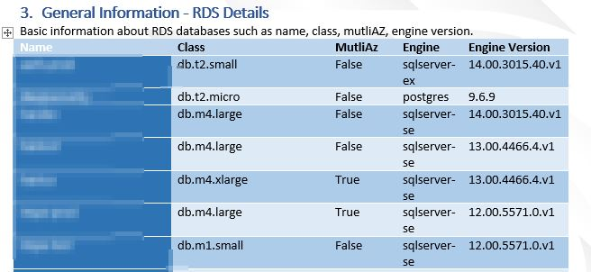
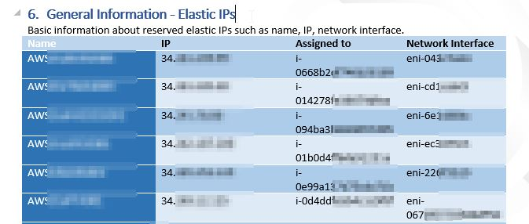
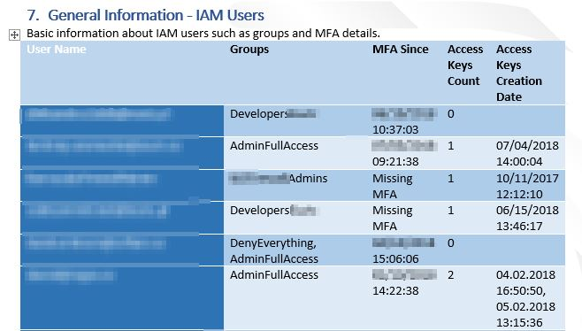

# AWS Part of the script

It uses [PowerShell SDK](https://aws.amazon.com/powershell/) to generate list of resources. For now it supports:
- EC2 (Instance details, name, environment, IP etc.)
- RDS (Instance details, environment, name, etc.)
- ELB & ALB (Name, type of LB, scheme, DNS Name, targets)
- Network (Subnet details, CIDRs, VPC)
- Elastic IPs (IP, where is it attached)
- IAM (User details, groups, MFA, access keys)

## How to use

You have to provide:
- AWS Access Key
- AWS Secret Key
- Region to scan

Read-Only policy can be found in `Data/PSWinDocumentation-Policy.json`.

`Please make sure that tagged items as a [tag] must be filled on AWS side. Otherwise these values will be empty.`

## EC2 Details

Returns list of EC2 instance details:
- InstanceID
- InstanceName `[tag]`
- Environment `[tag]`
- InstanceType
- PrivateIpAddress
- PublicIpAddress

## RDS Details
Returns list of RDS instance details:
- InstanceName
- InstanceClass
- MultiAZ
- InstanceEngine
- InstanceEngineVersion
- Storage [GB]
- Environment `[tag]`

## ELB & ALB Details
Returs list of Load Balancer details:
- LBName
- LBType
- Scheme
- DNSName
- RegistredInstances (targets)

## Subnet Details
Returns list of subnets details:
- SubnetID
- SubnetName `[tag]`
- CIDR
- AvailableIp
- VPC

## Elastic IP Details
Returns list of EIPs details:
- Name `[tag]`
- PublicIP
- Instance attached to EIP
- Network interface attached to EIP

## IAM Details
Returns list of IAM Users details:
- UserName
- Groups attached to user
- MFA Details
- Access Key Details

